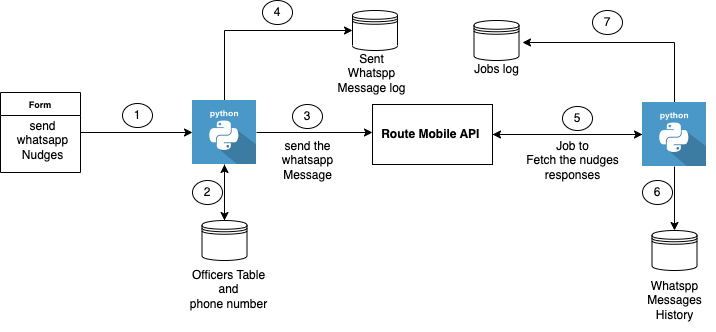

# whatsapp-nudges



## Setup on the new server and installation

#### Install Apache
```
sudo apt update
sudo apt install apache2
sudo ufw app list
sudo ufw allow in "Apache"
sudo ufw status
```

#### Install Mysql

````
sudo apt install mysql-server
sudo mysql_secure_installation

sudo mysql
ALTER USER 'root'@'localhost' IDENTIFIED WITH mysql_native_password by 'password';

#### Allow mysql to connect remotely
sudo systemctl restart mysql
sudo mysql
mysql -u root -p
RENAME USER 'root'@'localhost' TO 'root'@'ip_address';

GRANT CREATE, ALTER, DROP, INSERT, UPDATE, DELETE, SELECT, REFERENCES, RELOAD on *.* TO 'root'@'ip_address' WITH GRANT OPTION;

FLUSH PRIVILEGES;
exit

sudo nano /etc/mysql/mysql.conf.d/mysqld.cnf
Change the below line
bind-address            = 0.0.0.0

sudo ufw allow from ip_address to any port 3306
sudo ufw allow 3306
````

### Install Ngingx


## setup web-server using nginx

```
File: assets/constants.js
	BASE_URL: "http://128.199.18.80:90"

vi /etc/nginx/sites-available/samagra
	server {
        listen 90;

        server_name samagra www.samagra;

        location / {
                proxy_buffers 16 4k;
                proxy_buffer_size 2k;
                proxy_pass http://127.0.0.1:8000;

        }
	}

Hardlinking files:
	sudo ln -s /etc/nginx/sites-available/samagra /etc/nginx/sites-enabled

Test for syntax
	sudo nginx -t
	sudo nginx -s reload
	sudo systemctl restart nginx
```


## setup reverse-proxy server for backend-application using nginx

```
cd /var/www/html/whatsapp-nudges/wn-app/src && /var/www/html/whatsapp-nudges/wn-app/venv/bin/gunicorn -w 4 -k uvicorn.workers.UvicornWorker --log-file /var/www/html/whatsapp-nudges/wn-app/nudges.log main:app &
```
